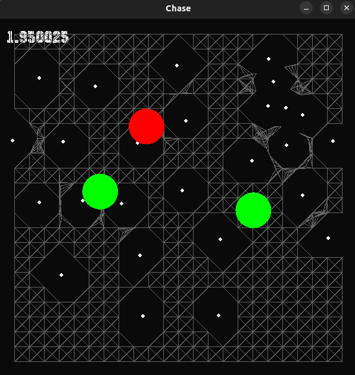
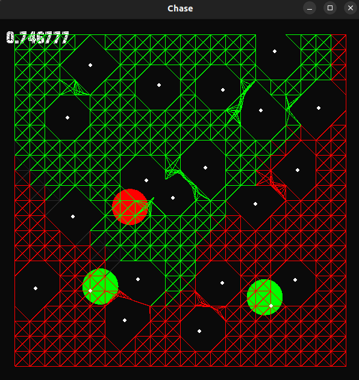

# Catch-up

### Description:

This is game, where you are chased by green robots and try to survive
for as long as possible. It is a test of **Fortune's algorithm of
Voronoi diagram** and path-finding algorithms. 

 

### How to run the game (only on Linux):

Project uses [**SFML**](https://www.sfml-dev.org/tutorials/2.5/start-linux.php)
as a graphic source, so make sure to install it.  

Run the file from **cmake-build-debug** by left-clicking your
mouse or with the command

> ./catch-up

### How to play:
You play as a red ball and avoid collisions with the green bots.
* You can set the walls on the field by clicking your **mouse**.
* Movements - keyboard buttons **A W S D**.
* Start the game - **Space** bar.
* Display options:
  * Show/hide Voronoi diagram - keyboard button **1**
  * Show/hide graph for path-finding - keyboard button **2**
  * Show/hide dynamic graph for path-finding - keyboard button **3**

Don't use **2** and **3** display option together to avoid unnecessary lag. 
### How path-finding works:
Using the Voronoi diagram the graph of possible positions is built.
Bots have 2 behaviour variants:
* Rush - using the Dijkstra’s algorithm bots uses the shortest path to the player
* Restrict - using BFS bot finds positions that are closer to him than
to the player (shown on graph as red). Then bot chooses the
direction of the highest ratio of red vertexes to the number of vertexes.

Those behaviours are changed so the bots don't stay in one place and 
track the player.
