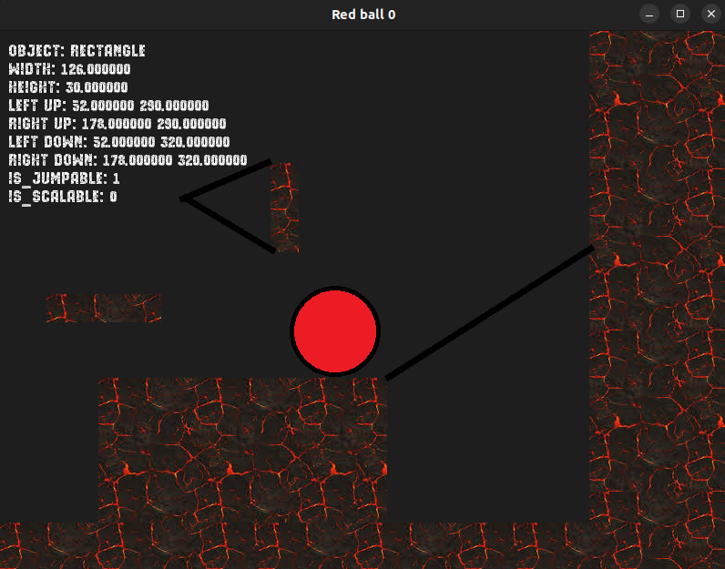
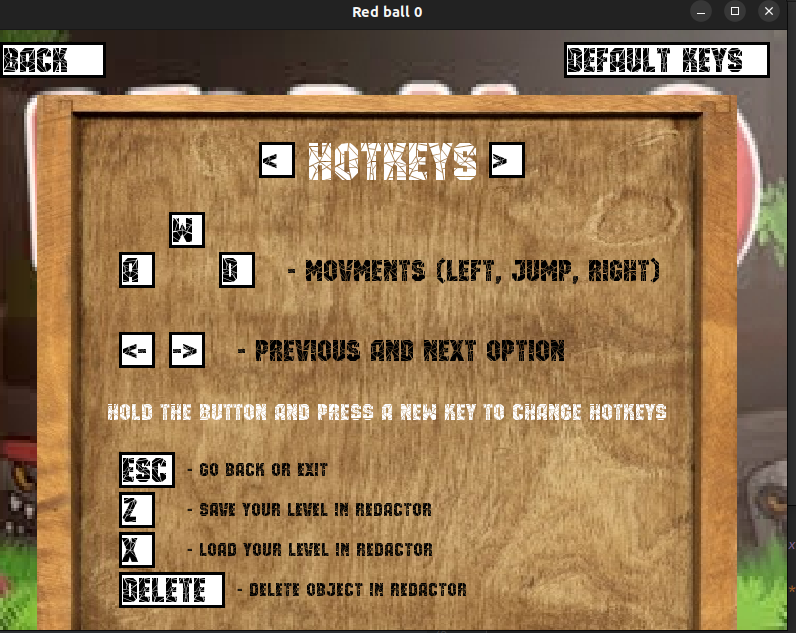

# Red ball 0

---

### Description:

The game is heavily inspired by popular Red ball series of games.
The objective is to complete segments of difficult parkour
reaching the end of the level. This was a semester project, so the
game isn't polished! Enjoy the terrible grafics, hardcore levels and
complicated level redactor.

### Features

* 3 really hard levels
* Changeable hotkeys
* Level redactor

### How to run the game (only on Linux):

Run the file from **cmake-build-debug** by left-clicking your
mouse or with the command

> ./SFML3

### How to play:
Most information is displayed in the **Settings**. Here is some
additional information.
* Menu:
  * All buttons are pressed with mouse. Additionally, **Esc** keyboard
  button can be used.
  * Only first 3 levels are active.
* Level redactor:
  * Level redactor works only through hotkeys and mouse. Most
  hotkeys are shown in **Settings** and can be changed.
  * You can move and scale objects with mouse. To delete object you
  need to hold it with the mouse first.