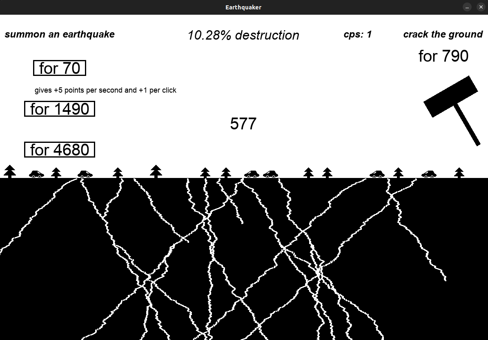

# Earthquaker

---

### Discription:

Small clicker game on Python.

### How to run the game (only on Linux):

Project uses [**pygame**](https://www.pygame.org/wiki/GettingStarted)
as a graphic source, so make sure to install it.  
You can run the game with following command in terminal in the 
same directory as the **main.py** file
> **python3 main.py**

### How to play:

* The goal is to destroy the ground and achieve 100% of destruction score.

* Press **space** or **click a mouse** to increase your score.
You can use those points to buy upgrades from the left buttons
or add more cracks to the ground with a **hammer**.

* You can place the cursor on buttons to see what you are buying.

* The **percent of destruction** is increased by the growth of the cracks.
The depth of the crack is increased by every point you get from clicking.

* There is a bonus for clicking faster than **6 cps** (clicks-per-second).

### Trivia:

* The song used in the game is **self-made**.

* The positions of trees and cars are random. Trees can be different size.
The position hammer hits is random too.
